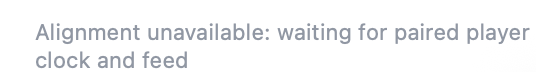

# Bug 2 — alignment-unavailable message appears on a stream that is not playing

**Status:** Open — reported by the user on 2026-10-04 after installing the M12 menubar build. Filed only; not fixed.
**Related milestone:** [M12](../milestones/milestone_12.md).

## Symptom: idle/stopped stream displays an alignment warning

The user reports that a stream that is not playing shows:

> Alignment unavailable: waiting for paired player clock and feed

Expected: do not present a playback-alignment failure for a stopped stream. Keep the genuine missing-clock/history state visible when applicable to active aligned playback.

### Evidence

- Installed app: `/Applications/PocketRadio.app`, M12 Debug build on `feature/kcrw-normal-use`, based on `464ca70` plus uncommitted changes.
- Installed executable SHA-256: `46af5c4d31a817d24258d0b7eec45cb8b9e98e62ec59682126ef024901855618`.
- The supplied crop shows the message only. It does not show transport controls, station identity, or the selected pill. The stopped/nonplaying state is the user's report; whether this was a paused current source or a different browsed stream is not independently established.
- `ContentView.swift:184–193` renders `alignmentUnavailableReason` unconditionally when non-nil.
- `PlayerViewModel.swift:638–647` derives that reason from eligible `currentSource` and missing `appliedOccurrence`, without checking `isPlaying` or selected-pill context.
- `resetAppliedPublication()` at `:753–770` restores the waiting-clock/feed reason. `stopPlayback()` at `:1973–2015` clears the session/item and stops playback without clearing `currentSource`.

### Root cause

Source inspection explains the paused eligible-source case: the source-level alignment predicate deliberately remains true while paused to block legacy feed/lyric publication. The UI incorrectly uses that isolation predicate as sufficient reason to show a playback warning. The exact selected-pill state of the reported occurrence is not confirmed.

### Proposed fix

Separate warning presentation eligibility from source-level publication isolation. Hide the warning when playback is stopped. Scope the message to the relevant playing source rather than implying that a browsed, nonplaying stream has an alignment failure. Do not weaken the guards that reject legacy titles, wall-clock lyrics, saved offsets, or stale callbacks while paused.

Add regression checks for idle/stopped eligible KCRW, pause/resume, browsing a nonplaying stream while another source plays, and genuinely unavailable alignment during active eligible playback. Preserve the M12 fail-closed behavior and reconnect-only pause.

## Files involved

Paths are relative to `pocket-radio-menubar/`:

- `PocketRadio/ContentView.swift` — ordinary alignment message presentation.
- `PocketRadio/View Models/PlayerViewModel.swift` — alignment predicate/reason and pause teardown.
- `PocketRadioTests/StreamSessionIntegrationTests.swift` — existing unavailable-state checks; distinguish internal isolation from visible stopped-state warnings.
